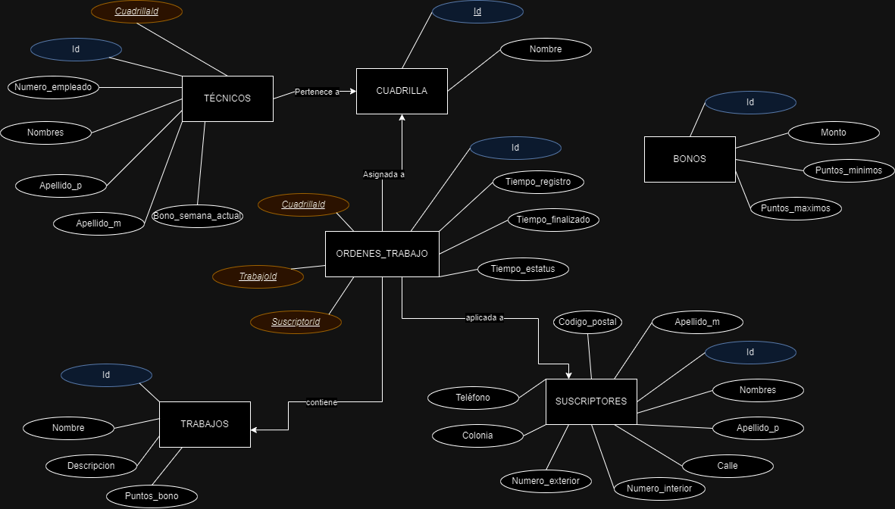
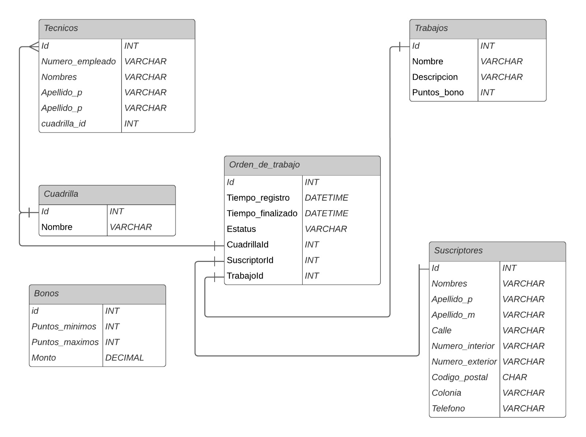

# Calculo de bonos

## Equipo

Integrantes del equipo Equipo-4-Mega (DevHeroes)

- Agustín Aguilar Eusebio
- Jesus Antonio Leyva Apodaca
- Diana Lizeth Alcala Sandoval
- Jonatan Leonardo Rodriguez Ocampo
- Bryan Shaloat Be Barragan Pulido

# Responsabilidades y actividades

El desarrollo del proyecto se llevó a cabo de manera altamente eficiente, con cada miembro del equipo desempeñando su rol con precisión y responsabilidad. La colaboración fue clave para optimizar los tiempos y la calidad del trabajo, permitiendo que cada persona, desde el backend hasta la gestión de la base de datos, aportara su experiencia de forma efectiva. Gracias a esta sinergia, se alcanzaron los objetivos del proyecto y dentro de los plazos establecidos.

## Frontend

- Diana Lizeth Alcala Sandoval
- Jonatan Leonardo Rodriguez Ocampo

1. Desarrollo de Interfaz
2. Integración de Backend con Frontend
3. Creación de servicios para el consumo de API's
4. Gestión de Github para el proyecto.

## Backend

- Bryan Shaloat Be Barragan Pulido

1. Gestión de comunicación entre la aplicación y la base de datos
2. Creación de API's
3. Creación de servicios para procesos almacenados
4. Procesamiento de solicitudes

## Bases de datos

- Agustín Aguilar Eusebio
- Jesus Antonio Leyva Apodaca

1. Creación de la base de datos
2. Creación de tablas y estructura general
3. Creación de rocesos almacenados
4. Diseño de esquema

# Proyecto - Calculo de Bonos

Se requiere un sistema eficiente para calcular los bonos semanales de los técnicos colaboradores de Megacable. Cada técnico pertenece a una cuadrilla de trabajo, y a estas cuadrillas se les asignan órdenes de trabajo que detallan las tareas a realizar para los suscriptores. Cada tarea completada o finalizada en una orden de trabajo otorga una cierta cantidad de puntos, los cuales serán acumulados para el cálculo del bono semanal.

El sistema deberá integrar un tabulador de puntos, que define los rangos de puntos acumulados y los montos correspondientes al bono a pagar. Este tabulador permitirá determinar con precisión el monto que cada colaborador recibirá, según los puntos obtenidos por las tareas finalizadas dentro del período evaluado.

# Análisis

Comenzamos por el análisis del problema, para poder modelar entidades en una base de datos, y eso no fue muy difícil al principio ya que solo teníamos que considerar entidades obvias que estaban fuertemente o directamente relacionadas como: "Técnico", "Trabajo", "Cuadrilla", "Orden de trabajo". Pero a la hora de querer abstraer la entidad de los puntos, allí fue donde se requería un poco más de análisis.

Nos fuimos por un enfoque en el que tenemos una tabla para almacenar los tabuladores de pago y así calcular el monto a pagar. En un principio se quería solamente calcular ese monto y esos puntos con procedimientos almacenados y no guardarlo en ningun sitio, pero más adelante quisimos agregar un campo a la tabla del técnico para tener un registro de cuánto se le pagó o debería pagar en el "periodo" o semana actual, ya que el cálculo debe ser semanal.

# Procesos

Comenzamos con la creación y el proceso para la base de datos ya que fue nuestro mayor enfoque al comienzo del proyecto y durante su desarrollo.

## Base de datos

Este es un diagrama de como sería la base de datos


Este es el diagrama entidad relacion


Estas son las queries necesarias para crear la base de datos y sus tablas:

```
create database Hackaton;
go

use Hackaton;
go

CREATE TABLE Cuadrillas(
	Id INT PRIMARY KEY IDENTITY(1,1),
	Nombre NVARCHAR(50)
);

CREATE TABLE Bonos(
	Id INT PRIMARY KEY IDENTITY(1,1),
	Puntos_minimos INT,
	Puntos_maximos INT,
	Monto DECIMAL(19, 4)
);

CREATE TABLE Tecnicos(
	Id INT PRIMARY KEY IDENTITY(1,1),
	Numero_empleado NVARCHAR(20),
	Nombres NVARCHAR(255),
	Apellido_p NVARCHAR(100),
	Apellido_m NVARCHAR(100),
	Bono_semana_actual DECIMAL(19,4) DEFAULT 0,
	CuadrillaId INT,
	CONSTRAINT FK_Tecnico_Cuadrilla FOREIGN KEY (CuadrillaId) REFERENCES Cuadrillas(Id),
);

CREATE TABLE Suscriptores(
	Id INT PRIMARY KEY IDENTITY(1,1),
	Nombres NVARCHAR(100),
	Apellido_p NVARCHAR(50),
	Apellido_m NVARCHAR(50),
	Calle NVARCHAR(50),
	Numero_interior NVARCHAR(5),
	Numero_exterior NVARCHAR(5),
	Codigo_postal CHAR(5),
	Colonia NVARCHAR(50),
	Telefono NVARCHAR(11)
);

CREATE TABLE Trabajos(
	Id INT PRIMARY KEY IDENTITY(1,1),
	Nombre NVARCHAR(100),
	Descripcion NVARCHAR(100),
	Puntos_bono INT
);

CREATE TABLE Ordenes_trabajo(
	Id INT PRIMARY KEY IDENTITY(1,1),
	Tiempo_registro DATETIME,
	Tiempo_finalizado DATETIME,
	Estatus NVARCHAR(20),
	CuadrillaId INT,
	SuscriptorId INT,
	TrabajoId INT,
	CONSTRAINT FK_Order_Cuadrilla FOREIGN KEY (CuadrillaId) REFERENCES Cuadrillas(Id),
	CONSTRAINT FK_Order_Suscriptor FOREIGN KEY (SuscriptorId) REFERENCES Suscriptores(Id),
	CONSTRAINT FK_Order_Trabajo FOREIGN KEY (TrabajoId) REFERENCES Trabajos(Id),
);

```

Algunos datos para probar la base de datos

```
INSERT INTO Bonos (Puntos_minimos, Puntos_maximos, Monto) VALUES
(0, 80, 0.00),
(81, 150, 300.00),
(151, 210, 500.00),
(211, -1, 650.00);

INSERT INTO Cuadrillas (Nombre) VALUES
('Cuadrilla 1'),
('Cuadrilla 2'),
('Cuadrilla 3'),
('Cuadrilla 4'),
('Cuadrilla 5'),
('Cuadrilla 6'),
('Cuadrilla 7'),
('Cuadrilla 8'),
('Cuadrilla 9'),
('Cuadrilla 10');

INSERT INTO Tecnicos (Numero_empleado, Nombres, Apellido_p, Apellido_m, CuadrillaId) VALUES
('1', 'Juan', 'Perez', 'Garcia', 1),
('2', 'Luis', 'Hernandez', 'Martinez', 2),
('3', 'Carlos', 'Gomez', 'Rodriguez', 3),
('4', 'Miguel', 'Lopez', 'Fernandez', 4),
('5', 'Jorge', 'Gonzalez', 'Ruiz', 5),
('6', 'Raul', 'Ramirez', 'Sanchez', 6),
('7', 'Pedro', 'Jimenez', 'Torres', 7),
('8', 'David', 'Vargas', 'Cruz', 8),
('9', 'Ricardo', 'Castillo', 'Ortiz', 9),
('10', 'Andres', 'Morales', 'Reyes', 10);

INSERT INTO Suscriptores (Nombres, Apellido_p, Apellido_m, Calle, Numero_interior, Numero_exterior, Codigo_postal, Colonia, Telefono) VALUES
('Maria', 'Gonzalez', 'Lopez', 'Av. Siempre Viva', '10', '5', '12345', 'Centro', '3321325355'),
('Ana', 'Perez', 'Ramirez', 'Calle 2', '2A', '3', '67890', 'Norte', '3321325355'),
('Lucia', 'Hernandez', 'Soto', 'Calle 3', '4', '12', '54321', 'Sur', '3321325355'),
('Carmen', 'Jimenez', 'Flores', 'Calle 4', '7B', '15', '67890', 'Oeste', '3321325355'),
('Jose', 'Rodriguez', 'Nunez', 'Calle 5', 'A', '8', '23456', 'Este', '3321325355'),
('Carlos', 'Martinez', 'Diaz', 'Calle 6', 'B', '9', '34567', 'Centro', '3321325355'),
('Alberto', 'Castro', 'Leon', 'Calle 7', 'C', '10', '45678', 'Norte', '3321325355'),
('Gabriela', 'Vega', 'Ortiz', 'Calle 8', 'D', '11', '56789', 'Sur', '3321325355'),
('Marta', 'Lara', 'Ruiz', 'Calle 9', 'E', '12', '12345', 'Este', '3321325355'),
('Sofia', 'Moreno', 'Perez', 'Calle 10', 'F', '13', '34567', 'Centro', '3321325355');

INSERT INTO Trabajos (Nombre, Descripcion, Puntos_bono) VALUES
('Instalacion de fibra optica', 'Instalacion de cableado para fibra optica', 300),
('Reparacion de modem', 'Reparacion y configuracion de modem', 150),
('Mantenimiento de redes', 'Mantenimiento preventivo de redes', 250),
('Configuracion de router', 'Configuracion avanzada de routers', 180),
('Instalacion de antena', 'Instalacion de antena para TV satelital', 350),
('Reparacion de cableado', 'Reparacion de cableado defectuoso', 220),
('Cambio de equipo', 'Cambio de equipo de telecomunicaciones', 400),
('Actualizacion de software', 'Actualizacion de software de red', 120),
('Solucion de fallas de red', 'Deteccion y solucion de fallas de red', 270),
('Instalacion de equipo adicional', 'Instalacion de nuevo equipo de red', 310);

```

En la tabla de bonos tengo 3 campos además del ID del bono. Tengo puntos mínimos, puntos máximos y el monto.

Tengo un -1 en el rango más alto de Bonos, porque no encontré otra manera de implementar que si los puntos de un técnico eran más del último rango, te devolviera el último monto, y esto lo saqué con un procedimiento almacenado, que si no encuentra el rango al que pertenece en puntos, pues buscara el -1 en puntos_maximos y devolviera ese bono, lo que me da entrada a mostrar los procedimientos almacenados que se utilizan para los cálculos:

```
CREATE PROCEDURE ObtenerMontoPorPuntos
    @Puntos INT,
    @Monto DECIMAL(19,4) OUTPUT
AS
BEGIN
    -- Si los puntos son menores a 0, retornar 0
    IF @Puntos < 0
    BEGIN
        SELECT 0 AS Monto;
        RETURN;
    END

    -- Verificar si los puntos se encuentran dentro de alg�n rango
    IF EXISTS (SELECT 1 FROM Bonos WHERE @Puntos BETWEEN Puntos_minimos AND Puntos_maximos)
    BEGIN
        -- Retornar el monto del bono que corresponde al rango de puntos
        SELECT @Monto = Monto
        FROM Bonos
        WHERE @Puntos BETWEEN Puntos_minimos AND Puntos_maximos;
    END
    ELSE IF EXISTS (SELECT 1 FROM Bonos WHERE Puntos_maximos = -1)
    BEGIN
        -- Si no hay coincidencia, retornar el monto donde Puntos_maximos sea -1
        SELECT @Monto = Monto
        FROM Bonos
        WHERE Puntos_maximos = -1;
    END
END;
```

Este procedimiento almacenado recibe como parámetro cierta cantidad de puntos y regresa un monto decimal de 4 dígitos de precisión.

Primero se valida si los puntos son menores de 0 y regresa 0 de monto.

Después busca si entra el algún rango de la tabla de puntos, si sí entra, regresa ese resultado.

Para finalizar, si no encuentra ninguna coincidencia, entonces regresa el monto que tiene como puntos maximos -1.

Ahora para obtener los puntos por técnico:

```
CREATE PROCEDURE ObtenerPuntosTecnicoPorSemanaAutomatica (
    @TecnicoId INT,
    @TotalPuntos INT OUTPUT
)
AS
BEGIN
    DECLARE @Hoy DATE = GETDATE();
    DECLARE @DiaSemana INT;
    DECLARE @FechaInicioSemana DATE;
    DECLARE @FechaFinSemana DATE;

    SET DATEFIRST 1;

    -- Obtener el día de la semana actual (7 = Domingo, 6 = Sábado)
    SET @DiaSemana = DATEPART(WEEKDAY, @Hoy);

    -- Calcular el inicio de la semana (Sábado anterior)
    SET @FechaInicioSemana = DATEADD(DAY, -(CASE WHEN @DiaSemana = 7 THEN 0 ELSE @DiaSemana END), @Hoy);

    -- Calcular el fin de la semana (Domingo siguiente para considerar todo el dia sábado)
    SET @FechaFinSemana = DATEADD(DAY, (7 - (CASE WHEN @DiaSemana = 7 THEN 0 ELSE @DiaSemana END)), @Hoy);


    SET DATEFIRST 7;

    -- Imprimir la semana inicial y final
    PRINT 'Fecha Inicio de la Semana: ' + CONVERT(VARCHAR, @FechaInicioSemana, 23);
    PRINT 'Fecha Fin de la Semana: ' + CONVERT(VARCHAR, @FechaFinSemana, 23);

    -- Calcular los puntos totales en el rango de fechas de la semana
    SELECT @TotalPuntos = SUM(T.Puntos_bono)
    FROM Ordenes_trabajo OT
    JOIN Tecnicos TE ON TE.CuadrillaId = OT.CuadrillaId
    JOIN Trabajos T ON T.Id = OT.TrabajoId
    WHERE TE.Id = @TecnicoId
    AND OT.Estatus = 'Finalizado'
    AND OT.Tiempo_finalizado >= @FechaInicioSemana  -- Desde el inicio de la semana
	AND OT.Tiempo_finalizado < @FechaFinSemana; -- hasta el sabado a las 23:59

    -- Si no hay puntos, devolver 0
    IF @TotalPuntos IS NULL
    BEGIN
        SET @TotalPuntos = 0;
    END
END;
```

Este procedimiento recibe un id de técnico y regresa el total de puntos obtenidos en la semana, se encuentra el día que sea sábado de esta semana y se coloca como "FechaInicioSemana". Si el día de la semana es distinto de 7 (o sea, si es distinto a sábado), solo hay que restarle al día de hoy el número de día que es hoy. Si hoy es sábado, entonces no se resta nada.

Y para la fecha final, si hoy es domingo, agregarle 7 días para llegar al otro domingo, porque se considera todo el sábado hasta las 23 horas con 59 minutos y 59 segundos.

Ahora para obtener el monto por técnico, se hace una combinación de ambos procedimientos:

```
CREATE PROCEDURE ObtenerMontoTotalTecnico (
    @TecnicoId INT
)
AS
BEGIN
    DECLARE @Puntos INT;
    DECLARE @Monto DECIMAL(19, 4);

    -- 1. Obtener los puntos totales del técnico usando el parámetro OUTPUT
    EXEC ObtenerPuntosTecnicoPorSemanaAutomatica @TecnicoId, @Puntos OUTPUT;

    -- 2. Calcular el monto basado en los puntos usando el parámetro OUTPUT
    EXEC ObtenerMontoPorPuntos @Puntos, @Monto OUTPUT;

    -- Devolver el monto total
    SELECT @Monto AS MontoTotal;
END;
```

Se tienen que agregar estos procedimientos a su base de datos para que funcione el sistema, ya que de aquí obtenemos la información necesaria para mostrar los resultados de los bonos.

Para probarlo, utilizé estos registros, que para el técnico 1, hay 4 ordenes de trabajo, 3 entran dentro de la semana del 29 de septiembre del 2024 a 5 de octubre del 2024. Tengo un registro del 6 de octubre del 2024 para mostrar que no se considera ese registro.

```
INSERT INTO Ordenes_trabajo (Tiempo_registro, Tiempo_finalizado, Estatus, CuadrillaId, SuscriptorId, TrabajoId) VALUES
-- El domingo de la siguiente semana (2024-10-06)
('2024-10-01T08:00:00', '2024-10-06T09:30:00', 'Finalizado', 1, 3, 3),

-- Hoy (2024-09-29)
('2024-09-29T08:00:00', '2024-09-29T10:30:00', 'Finalizado', 1, 1, 1),
('2024-09-29T11:00:00', NULL, 'En progreso', 2, 2, 2),
('2024-09-29T12:15:00', NULL, 'En espera', 3, 3, 3),
('2024-09-29T13:30:00', NULL, 'Cancelado', 4, 4, 4),
('2024-09-29T14:00:00', '2024-09-29T16:30:00', 'Finalizado', 5, 5, 5),
('2024-09-29T15:00:00', NULL, 'En progreso', 6, 6, 6),
('2024-09-29T16:30:00', NULL, 'En espera', 7, 7, 7),
('2024-09-29T17:00:00', '2024-09-29T19:30:00', 'Finalizado', 8, 8, 8),
('2024-09-29T18:00:00', NULL, 'Cancelado', 9, 9, 9),
('2024-09-29T19:30:00', NULL, 'En espera', 10, 10, 10),

-- Mañana (2024-09-30)
('2024-09-30T08:00:00', '2024-09-30T10:00:00', 'Finalizado', 1, 2, 3),
('2024-09-30T09:00:00', NULL, 'En progreso', 2, 3, 4),
('2024-09-30T10:30:00', '2024-09-30T12:45:00', 'Finalizado', 3, 4, 5),
('2024-09-30T11:45:00', NULL, 'En espera', 4, 5, 6),
('2024-09-30T12:00:00', NULL, 'Cancelado', 5, 6, 7),
('2024-09-30T13:30:00', '2024-09-30T15:30:00', 'Finalizado', 6, 7, 8),
('2024-09-30T14:00:00', NULL, 'En progreso', 7, 8, 9),
('2024-09-30T15:30:00', NULL, 'En espera', 8, 9, 10),
('2024-09-30T16:00:00', '2024-09-30T18:00:00', 'Finalizado', 9, 10, 1),
('2024-09-30T17:30:00', NULL, 'En espera', 10, 1, 2),

-- Pasado mañana (2024-10-01)
('2024-10-01T08:00:00', '2024-10-01T09:30:00', 'Finalizado', 1, 3, 3),
('2024-10-01T09:00:00', NULL, 'En progreso', 2, 4, 4),
('2024-10-01T10:00:00', NULL, 'En espera', 3, 5, 5),
('2024-10-01T10:30:00', NULL, 'Cancelado', 4, 6, 6),
('2024-10-01T11:00:00', '2024-10-01T13:00:00', 'Finalizado', 5, 7, 7),
('2024-10-01T12:30:00', NULL, 'En progreso', 6, 8, 8),
('2024-10-01T13:45:00', NULL, 'En espera', 7, 9, 9),
('2024-10-01T14:15:00', '2024-10-01T16:30:00', 'Finalizado', 8, 10, 10),
('2024-10-01T15:30:00', NULL, 'Cancelado', 9, 1, 1),
('2024-10-01T16:45:00', NULL, 'En progreso', 10, 2, 2);
```

Para hacer el cálculo de todos los técnicos y asignar a su campo de "bono_semana_actual", se utiliza el siguiente procedimiento almacenado. Este está pensado para ejecutarse cada semana con una tarea programada en la base de datos o con el programador de tareas de windows con.

```
sqlcmd -S servidor -d basededatos -U usuario -P pass -Q "EXECUTE ActualizarBonoSemana"
```

```
CREATE PROCEDURE ActualizarBonoSemana
AS
BEGIN
    DECLARE @TecnicoId INT;
    DECLARE @Puntos INT;
    DECLARE @Monto DECIMAL(19, 4);

    -- Create a temporary table to hold results
    CREATE TABLE #ResultadosTecnicos (
        TecnicoId INT,
        Puntos INT,
        Monto DECIMAL(19, 4)
    );

    -- Cursor to iterate over each technician
    DECLARE TecnicoCursor CURSOR FOR
    SELECT Id FROM Tecnicos;

    OPEN TecnicoCursor;
    FETCH NEXT FROM TecnicoCursor INTO @TecnicoId;

    WHILE @@FETCH_STATUS = 0
    BEGIN

		PRINT('ESTOY EN ID ' + str(@TecnicoId))

        -- Obtain total points for the technician
        EXEC ObtenerPuntosTecnicoPorSemanaAutomatica @TecnicoId, @Puntos OUTPUT;

		PRINT('Puntos ' + str(@Puntos))

        -- Calculate amount based on the points
        EXEC ObtenerMontoPorPuntos @Puntos, @Monto OUTPUT;

		PRINT('Monto correspondiente ' + str(@Monto))

        -- Insert the results into the temporary table
        INSERT INTO #ResultadosTecnicos (TecnicoId, Puntos, Monto)
        VALUES (@TecnicoId, @Puntos, @Monto);

        -- Fetch the next technician
        FETCH NEXT FROM TecnicoCursor INTO @TecnicoId;
    END;

    CLOSE TecnicoCursor;
    DEALLOCATE TecnicoCursor;

    -- Update the Bono_Semana_actual column for all technicians
    UPDATE TE
    SET TE.Bono_semana_actual = RT.Monto
    FROM Tecnicos TE
    JOIN #ResultadosTecnicos RT ON TE.Id = RT.TecnicoId;

    -- Drop the temporary table after use
    DROP TABLE #ResultadosTecnicos;
END;
GO
```

## Backend

Para el backend se creo un sistema sencillo de API's y servicios que gestionara la comunicación con la base de datos y las peticiones de cliente

API's

Obtener Tecnicos

```
GET http://localhost:5000/api/Tecnicos
```

Editar Tecnicos

```
PUT http://localhost:5000/api/Tecnicos
```

Agregar Tecnicos

```
POST http://localhost:5000/api/Tecnicos
```

Obtener Cuadrilla

```
GET http://localhost:5000/api/Cuadrillas
```

Obtener tecnicos que pertenecen a una cuadrilla

```
GET http://localhost:5000/api/Tecnicos-Cuadrilla
```

Obetener Tabulador

```
GET http://localhost:5000/api/Tabulator
```

Actualizar tabulador

```
POST http://localhost:5000/api/UpdatePuntos
```

Obtener Ordenes de trabajo

```
GET http://localhost:5000/api/ordenes
```

Obtener Monto x Tecnicos

```
GET http://localhost:5000/api/MontoxTecnico
```

El uso de servicios para gestionar los procedimientos almacenados que permiten el cálculo de los datos fue implementado de manera eficiente y sin mayores complicaciones. Estos servicios están diseñados para interactuar de forma óptima con los procedimientos almacenados en la base de datos, lo que asegura una comunicación fluida y precisa. Esta arquitectura simplifica la lógica del cálculo y garantiza la precisión y velocidad en la obtención de resultados.

## Frontend

El front-end se desarrolló utilizando Angular en su versión 16 junto con Node.js en la versión 18.20.4. Para el proyecto, se realizaron los siguientes componentes:

-LoginPageComponent: Muestra un inicio de sesión.
-BonusesComponent: Muestra los bonos que reciben los técnicos, y los puntos mínimos y máximos que corresponden a los bonos.
-OrdersPageComponent: Muestra información relacionada al técnico y sus órdenes de trabajo (finalizadas, en espera, en proceso y canceladas), además permite la descarga de un PDF y un XLSX con un reporte de las órdenes de trabajo con su respectivo bono.
-TechniciansPageComponent: Muestra un listado de los técnicos y su información, también permite editar la información de un técnico y agregar un nuevo técnico.
-WorkCrewsComponent: Muestra un listado de las cuadrillas.

De igual manera, creamos los siguientes servicios para el funcionamiento de nuestro sistema:

-BonusesService: Este servicio consta de dos funciones: getTabulator$, que obtiene el tabulador de los bonos; y updateBonus$, que permite la actualización de los bonos.
-OrdersService: En este servicio encontramos dos funciones: getOrders$, que obtiene información del técnico y las órdenes de trabajo que tiene asignadas; y getTotalAmount$, que obtiene el monto total que se le pagará al técnico por las órdenes de trabajo que haya realizado.
-TechniciansService: Este servicio tiene tres funciones: getTechnicians$, que obtiene el listado de técnicos; setTechnicians$, que permite la creación de un nuevo técnico; y updateTechnicians$, que permite la actualización de un técnico.
-WorkCrewsService: Este servicio se dedica exclusivamente a traer la información de las cuadrillas con la función: getWorkCrews$.

Asimismo se hizo uso de un pipe, SearchPipe, que permite la búsqueda de técnicos.

A continuación, se muestran imágenes del sistema en funcionamiento.

Inicio de sesión


Listado de técnicos


Formulario para editar técnico


Formulario para agregar técnico


Información de técnico


PDF generado


Excel generado


Listado de cuadrillas


Listado de bonos


Formulario para editar bono


## Resultados y soluciones

La solución a ofrecer:

- Automatización del cálculo de puntos y bonos para reducir errores manuales.
- Asignación precisa de puntos a trabajos completados.
- Un tabulador dinámico para ajustar montos y rangos según las políticas de la empresa.
- Informes claros y detallados que permitan la supervisión y revisión de los bonos asignados a cada técnico, cuadrilla y periodo.

Este sistema garantizará una distribución justa y transparente de los bonos, motivando a los técnicos a maximizar su rendimiento.
