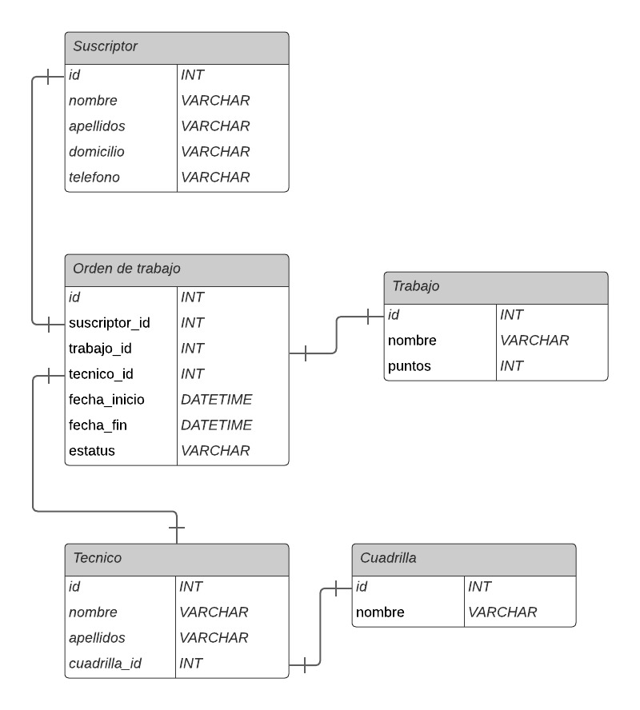
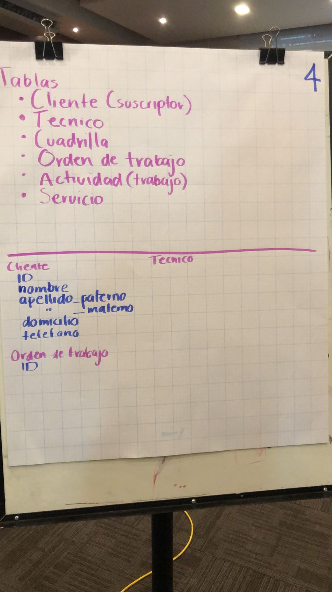
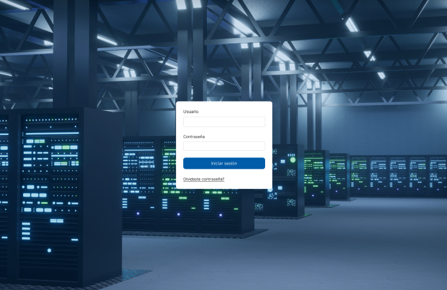

### Hackathon equipo 4 DevHeros

## Objetivo
Reunir a personas en equipo para resolver un problema, en este tipo de eventos se puede ver ya sea  presencialmente o virtual, las actitudes y aptitudes de los integrantes.

## Proceso
- Para empezar, antes de las 9:00 nos dierton 15 minutos para escoger y asignar los roles del equipo, comenzamos por preguntarnos entre nosotros qué es lo que nos gustaría hacer, cuáles eran nuestras fortalezas.

Se tenía que elegir un líder de equipo y un documentador, como roles principales. Se escogieron.

Quedamos divididos de la siguiente manera:
- Una persona se encargaría de la creación de la base de datos y llevar la computadora.
- Otra persona se dedicaría a verlo del backend
- Otras dos personas se dedicarían a verlo de el frontend
- Y otra se dedicaría a la docmentación

Pero antes de eso, todos estuvimos analizando el problema y aportando ideas.

Decidimos empezar por el modelado de la base de datos, una vez entendiendo el problema,
Se modeló en equipo y se llegó a un diagra entidad relación como el siguente:

Esto basado en nuestro análisis que hicimos en el material que nos entregaron para dibujar.

Después de tener el diagrama entidad relacion, ya el encargado de base de datos comenzo a escribir los scripts para crear las tablas en nuestra base de datos.

Tuvimos una pequeña reunión para quedar en claro lo que ibamos a hacer.

El equipo de front comenzó a diseñar las vistas y el equipo de backend comenzó a generar los modelos.

Tenemos este login:

## Concluciones del análisis

Se va a generar un dashboard para los encargados de la nómina de mega.
En el que el encargado pueda visualizar con reportes, el monto del bono de ese colaborador
